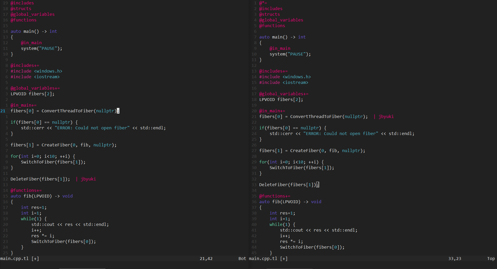

ntrance.nvim
============

ntrance is a collaborative remote editing plugin for Neovim written in Lua with no dependencies.

**This is in prototype stage. It should work but some important features are still missing!**
**The transfer protocol is not optimized for large files transfer!**

* [Design document](docs/design.md)
* [Protocol](docs/protocol.md)
* [Commands](docs/commands.md)



Requirements
------------

* Neovim (tested on 0.5 but should work on previous versions)

Install
-------

The easiest is to install using a plugin manager such as [vim-plug](https://github.com/junegunn/vim-plug)

```
Plug 'jbuyki/ntrance.nvim'
```

Configurations
--------------

* To configure your username, put this in your $MYVIMRC. This **must be** set to start or join a server.

```
lua vim.g.ntrance_username = "YOUR USERNAME"
```

Usage
-----

1. Fire up the websocket server (server/ws_server.js)
2. Create a sharing folder
```
mkdir client1
```
3. Start neovim into this folder
```
cd client1/
neovim
```
	
	* Make sure the current folder is correct with `:pwd`. The sharing folder needs to be correct otherwise
	  it will put the wrong files on the server! Don't worry if the folder is not empty, it will not be able
	  to create the server.

4. Connect the first client with `NTranceStart`
```
:NTranceStart 127.0.0.1 8080
```

5. Create another folder client2 and start the other instance of neovim
```
cd client1/
neovim
```

6. Join the connection with the second client with `NTranceJoin`
```
:NTranceJoin 127.0.0.1 8080
```

7. Now all files should be sync up!

Todo
----

* Multiple sessions on the same server
* Try to reconnect after connection failure
