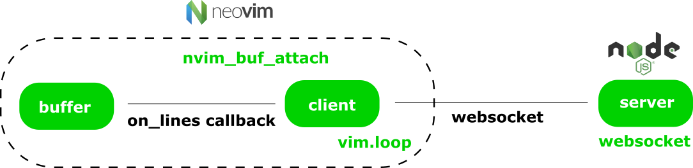

Design Document
===============

ntrance (entrance) is a collaborative text editing plugin for Neovim. It should allow multiple users to edit the same document at the same time remotely. The plugin infrastructure should simple. It should provide the bare minimum to get started. Installing third-party tools should be avoided when possible to provide the best setup experience. Ideally the user could add the plugin to his list and immediatly get started.

Plugin
------

* It should avoid third-party tools or libraries as the plugins in Neovim has no dependency management system
* Plugin is written in lua
* Support only Neovim at the moment
* The plugin should be immediatly useable after its installation

Architecture
------------

* Updates in the buffer are retrieved using `vim.loop.nvim_buf_attach`
* vim.loop has bindings to libuv which allow tcp networking. Websocket is built on top which allow bidirectional communication between the client and server
* The server is written in JS using node.js. The external websocket package is used.

Security
--------

* No communication over TLS is possible in the current state. It is planned to be supported in the future.

Multi-document editing
----------------------

* Edits in documents which are open should be intantenous
* Edits in documents which are not open in client should be buffered and applied only in a fixed interval

UI
--

* Visual cues should be minimal. Usually the collaborative tools show the cursor of other users that are connected. Is that not a distraction? Why not only show a message at the end of line where a user is currently editing.
* It must be identifiable who is editing
